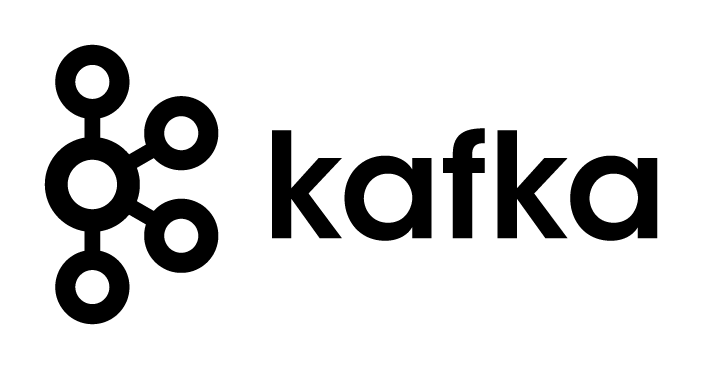

## 📖 Kafka-Dokumentation

Diese Dokumentation soll alle relevanten Fragestellungen systematisch beantworten und eine zentrale Wissensquelle für Kafka bei Puzzle werden.

### 1. Grundlagen & Strategischer Kontext
- **Was ist Apache Kafka?**  
  Apache Kafka ist eine verteilte Streaming-Plattform, die für das Verarbeiten großer Mengen an Echtzeitdaten entwickelt wurde und als zentraler Message-Broker in Event-driven Architekturen dient.

- **Typische Einsatzszenarien für Kafka**  
  Echtzeit-Datenintegration, Event-Sourcing, Microservices-Kommunikation, Log-Aggregation und verteilte Datenpipelines.

- **Vorteile und Nachteile von Kafka**

  | Vorteile                                       | Nachteile                                    |
  |-----------------------------------------------|----------------------------------------------|
  | Hohe Performance bei hohem Datendurchsatz     | Komplexes Setup                              |
  | Sehr gute horizontale Skalierbarkeit          | Betrieb erfordert fundiertes Know-how        |
  | Entkopplung von Producer und Consumer         | Weniger geeignet für einfache Queue-Fälle    |
  | Persistente Speicherung von Nachrichten       | Speicherbedarf bei langer Retention          |

- **Alternativen zu Kafka und deren Einordnung**  
  RabbitMQ, NATS, Pulsar – je nach Anwendungsfall geeigneter, z. B. für einfache Queuing-Fälle oder verteilte Streaming-Szenarien mit erweiterter Featurebasis.

- **Kafka im Vergleich zu anderen Message-Brokern**  
  Kafka ist auf hohe Durchsatzraten und Persistenz ausgelegt, während andere Systeme eher auf einfache Transaktionen oder Routing spezialisiert sind.

### 2. Architektur & Betrieb
- **Komponenten eines Kafka-Clusters**  
  Broker, Controller (bei KRaft), ZooKeeper (bei älteren Setups), Producer, Consumer, Schema Registry, Connect, MirrorMaker.

- **Deployment-Optionen: On-Prem, Cloud, Kubernetes**  
  Kafka kann klassisch auf Bare Metal, in der Cloud (z. B. MSK, Confluent Cloud) oder mit Kubernetes-basierten Operatoren (z. B. Strimzi) betrieben werden.

- **Hochverfügbarkeit & Skalierbarkeit**  
  Kafka erlaubt horizontale Skalierung durch Partitionierung; Replikation sorgt für Ausfallsicherheit. Hochverfügbarkeit wird durch mehrere Broker und Controller sichergestellt.

- **Multi-Tenant-Cluster-Design**  
  Trennung über Namenskonventionen, ACLs, Quotas und ggf. eigene Kafka-Namespaces oder dedizierte Deployments je Team/Produkt.

### 3. Administration & Sicherheit
- **Verwaltung von Topics und Berechtigungen**  
  Topic-Erstellung automatisiert oder manuell, Verwaltung via CLI, UI oder GitOps. Rechtevergabe über ACLs.

- **Authentifizierung & Autorisierung (SASL, TLS, ACLs)**  
  Einsatz von TLS für Verschlüsselung und SASL (z. B. SCRAM oder OAuth2) zur Authentifizierung. Autorisierung über ACLs und Rollenkonzepte.

- **Quotas, Partitionierung, Datenaufbewahrung**  
  Ressourcenbegrenzung über Quotas, Partitionierung für Lastverteilung, Aufbewahrungsregeln zur Speicheroptimierung.

- **Namenskonventionen und Rollenmodelle**  
  Einheitliche Namensschemas für Topics, Consumer-Groups und ACLs helfen bei der Skalierung und Übersichtlichkeit.

### 4. Monitoring & Wartung
- **Relevante Metriken für Betrieb & Debugging**  
  Latenz, Lag, Throughput, Offline-Partitions, Replikationsstatus – auswertbar via Prometheus.

- **Tools: Grafana, Prometheus, Kowl, Cruise Control**  
  Stack zur Überwachung und Visualisierung von Kafka-Status, Consumer-Lag, Partitionen und Balancing.

- **Fehleranalyse: Replikationsprobleme, Lag etc.**  
  Ursachen können z. B. Netzwerkprobleme, Broker-Failures oder falsche Partitionierung sein. Visualisierung hilft bei der Eingrenzung.

- **Upgrade-Strategien (z. B. Migration ZooKeeper → KRaft)**  
  Planung und Testen in Staging-Umgebung notwendig; Dokumentation von Inkompatibilitäten und Migrationspfaden essenziell.

- **Backup- und Restore-Strategien**  
  Themen wie Snapshotting, Offloading auf S3, Retention Policies und Replikation auf Remote-Cluster.

### 5. DevOps & GitOps
- **Kafka Deployment mit Strimzi**  
  Strimzi ermöglicht deklaratives Kafka-Management via Kubernetes CRDs – inklusive Topic- und User-Verwaltung.

- **GitOps mit Argo CD**  
  Verwaltung der Kafka-Infrastruktur als Code; Änderungen werden versioniert und automatisiert deployed.

- **Helm-Charts & Umgebungsmanagement**  
  Helm als Packaging-Standard für wiederverwendbare Kafka-Komponenten und Konfigurationen.

- **CI/CD für Kafka-Workloads**  
  Pipelines zur automatischen Bereitstellung von Configs, Topics, Testdaten und Konsumenten-Setups.

### 6. Showcase & Beispiele
- **Beispielanwendungen (Producer/Consumer)**  
  Beispielhafte Producer in Node.js, Consumer in Go – zur Demonstration von Events und Metriken.

- **Setup eines Demo-Clusters**  
  Lokal mit Kind oder Remote via GKE/OpenShift – voll automatisiert mit Argo CD und Strimzi.

- **Security-Demo (z. B. TLS + ACLs)**  
  Beispielhafte Absicherung eines Topics via TLS und ACL-Regeln – sichtbar im Monitoring und via CLI überprüfbar.

- **Monitoring-Dashboards**  
  Visualisierung der Kafka-Metriken mit Grafana und Alerts bei Anomalien.

### 7. Interne Best Practices & Lessons Learned
- **Kundenprojekte & Erfahrungsberichte**  
  Sammlung von Erfahrungswerten aus vergangenen Projekten bei Puzzle.

- **Wiederverwendbare Templates**  
  Standardisierte Helm-Charts, Topic-Konventionen und Strimzi-CRs.

- **Tipps für Betrieb & Skalierung bei Puzzle**  
  Empfehlungen aus internen Labs zu Clustergröße, Sicherheit und Ressourcengrenzen.

### 8. Weiterführende Ressourcen
- **Offizielle Dokus & Links**  
  https://kafka.apache.org/, https://strimzi.io/, https://argo-cd.readthedocs.io/

- **Blogposts, Videos, Tutorials**  
  Sammlung nützlicher Inhalte zur Vertiefung der einzelnen Themenbereiche.

- **Tools & Erweiterungen**  
  Tools wie kafkacat, kafka-topics-ui, Redpanda Console, Schema Registry UIs u. a.